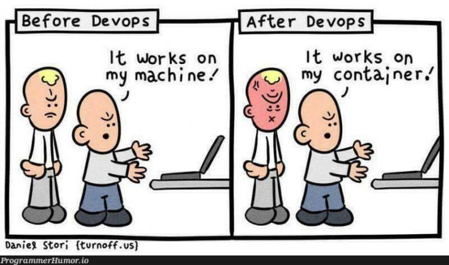

# Let's Get started

The labs leverage GitHub Codespaces with Terraform plans to build out basic environments for each CSP so we aren't spending out time together doing click-ops provision of a base environment. By leveraging GitHub Codespaces we avoid spending time installing tools, polluting your laptop, and hopefully avoid the dreaded "works on my machine".

[Lab 1: Setup Internet2 Insight Console](lab1.md)

[Lab 2: Using GitHub Codespaces](lab2.md)

[Lab 3: Authenticating and Configure CLI tools](lab3.md)

[Lab 4: Terraform deployment of CSP lab environments](lab4.md)

[Lab 5: Building Dedicated Connections to the Cloud](lab5.md)

[Lab 6: Testing and verifying routing](lab6.md)

[Lab 7: Verifying Routing Tables with the CSPs _(time permitting)_](lab7.md)

[Lab 8: Cleaning up (avoiding large bills)](lab8.md)

> [!CAUTION]
> **Take this work for what it is, a lab environment!**
>
> **The following non best practices are adhered to these labs:**
>
> - Building the slowest speed connection possible
> - Ignoring redundancy (single region, single zones, single connections, etc.)
> - Not using IPv6 in this version of the workshop
> - Using minimal security with wide open access
> - Local state for Terraform plans
> - Probably a whole bunch of others!

