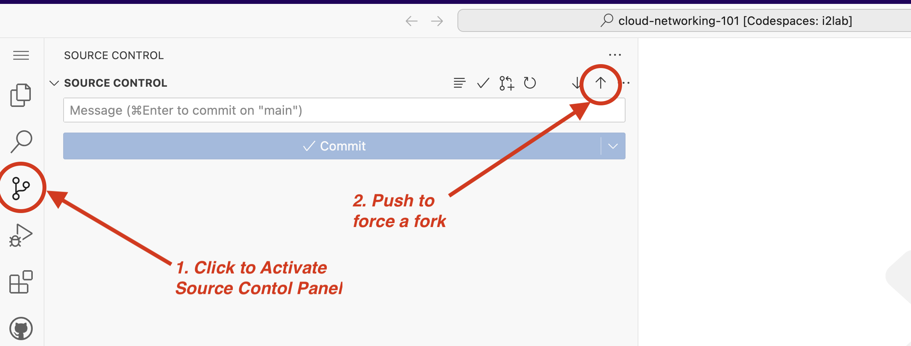
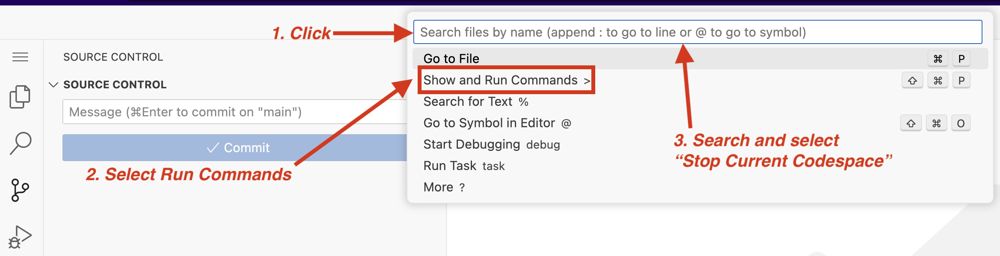

# Lab 2: Using GitHub Codespaces


## Background

In this Lab we will start up our GitHub Codespace with the Lab repository that will allow us to create a base cloud environment with each provider we'd like to build connectivity and test with. This will require access to your Cloud Service Provider accounts to create access credentials for the command line tools that the Terraform plans will use to provision the base cloud environments.

This Codespace includes a custom, prebuilt, devcontainer that has the following key packages preinstalled.

1. GitHub CLI
2. AWS CLI
3. Azure CLI
4. Google Cloud SDK
5. Oracle Cloud CLI
6. Terraform

---

## Starting GitHub Codespace

>[!NOTE]
> We start the Codespace from the original repository in order to take advantage of the prebuilt devcontainer and save time. However this will necessitate [forking to save changes](#forking-to-save-changes) which is covered in the next section.

Click below :arrow_down: to get started :rocket:

[](https://codespaces.new/ipv6tech/cloud-networking-101)

<!--
<details>
<summary><b>Otherwise follow the manual steps for Codespaces</b></summary>

1. To get started sign in to your [GitHub](https://github.com/login) account.
2. Navigate to the [Cloud Networking 101](https://github.com/ipv6tech/cloud-networking-101) workshop repository.
3. Select `Code`, `Codespace`, `Create codespaces on main`.
 This should open a new window and start to spin up your new Codespace.

</details>
-->

---

### Forking to save changes

>[!IMPORTANT]
> Make sure to do these steps carefully otherwise when the Codespace shutdowns due to inactivity you'll lose the environment variables that the Terraform plans expect.

After a minute or two the Codespace devcontainer will be running, next we'll fork the repository to save our environment.

The quickest way I figured out how to achieve this process:
1. Open the Source Control panel
2. Force a push.

3. Shutdown the Codespace.

4. Wait for the Codespace window to show a button to "Restart codespace".
5. Select "Restart codespace".
6. Verify the Codespace is using the fork under your account: In a Codespace shell run `echo $GITHUB_REPOSITORY`. It should print _**your_username/cloud-networking-101**_.

**Congratulations!**

You now have a Codespace devcontainer that uses the prebuilt image, will save changes to your fork, and use your Codespace Secrets for environment variables. Most importantly when the Codespace shutdown and restarts you won't lose the configuration, setup or Terraform local state. Make sure not to delete the Codespace until you are sure you no longer want to play around with the lab. From here on out stopping and starting the Codespace _should_ be fine.

---

### Authenticating CLI tools with each CSP

I'm not going to lie, this is going to be a bit of a slog for some of the providers. The easiest ones are Azure, AWS in that order. Google and Oracle are a bit more of a process.

> [!TIP]
> To save on time (_and frustration_) only setup the cloud providers you actually want to use for the lab.

<details>
<summary><b>Prepare AWS</b></summary>

1. To create an AWS security key, you can:
   1. Go to the AWS management console
   2. Click your profile name
   3. Click My Security Credentials
   4. Select Access Keys and click Create New Access Key
   5. Click Show Access Key
   6. Save and download the access key and secret access key
2. From the Codespaces shell run `aws configure`.
3. Copy and Paste the Access Key and Secret Access key from the AWS console into the Codespace shell when prompted.
4. At the prompt for region enter `us-east-1`.
5. At the prompt for Default output format [None]: you can accept the default of None and hit enter.

At this point you've configured AWS CLI tools with the same permissions as your user account and we will be able to use the Terraform plan to build the i2lab environment in AWS.

</details>

<details>
<summary><b>Prepare Azure</b></summary>

1. From the Codespaces shell run `az login --use-device-code`.
2. Follow the directions to authenticate the azure cli tools with your account.
3. From the output in the shell find the line that includes `"id": "000000-0000-0000-0000-00000000"` and copy the string.
4. From the Codespaces shell run `export TF_VAR_SUBSCRIPTION_ID="<paste the id from above>"` and hit enter.

At this point you've authenticated the Azure CLI tools with the permissions of your user account and exported the subscription_id as an environment variable that will be used by the Terraform plan to build out the Azure i2lab environment.

#### Push our Azure environment variables into Codespaces Secrets

Let's push the environment variable(s) we setup in the previous section our Codespaces Secrets. This is how we can get securely set and get the environment variables to persist between Codespace restarts.

Copy and paste the following into a Codespace Shell:

```bash
gh secret set TF_VAR_SUBSCRIPTION_ID -b "$TF_VAR_SUBSCRIPTION_ID" -u -r $GITHUB_REPOSITORY
```

</details>

<details>
<summary><b>Prepare Google Cloud</b></summary>

> **Buckle up for this one!**

Before we can prepare the cli tools to build out our lab environment we have a bit of work to take care of.

>[!TIP]
>Hopefully you were able to complete the list below prior to the workshop.

- [Create a Google Cloud Account](https://cloud.google.com/free?hl=en).
- [Setup a billing account](https://cloud.google.com/billing/docs/how-to/create-billing-account#create-new-billing-account).
- [Create a project](https://cloud.google.com/resource-manager/docs/creating-managing-projects#creating_a_project) for the lab to provision into, I recommend something like `i2lab-2024` or `techex2024` for the project name.
- [Enable billing for the new project](https://cloud.google.com/billing/docs/how-to/modify-project).
- Enable Compute API for the project. (The easy way to do this is to navigate into the [VPC Networks](https://console.cloud.google.com/networking/networks) and click "Enable Compute API" in the console.)

#### Next authenticate the gcloud sdk tools with your Google Cloud account and create a credentials file

1. From the Codespaces shell run `gcloud init`.
2. At the prompt to sign in hit `enter`.
3. Copy the very long URL into a new web browser window and sign in with your Google Cloud account.
4. Copy the verification code.
5. Paste the verification code into the Codespaces shell and hit `enter`.
6. From the list choose the project you created for this workshop.
7. In the Codespaces shell run `gcloud projects list` and note the PROJECT_ID for your new project.
8. In the Codespaces shell run `export TF_VAR_GC_PROJECT_ID="<PROJECT_ID>"`

#### Push our Google Cloud environment variables into Codespaces Secrets

Let's push the environment variable(s) we setup in the previous section our Codespaces Secrets. This is how we can get securely set and get the environment variables to persist between Codespace restarts.

Copy and paste the following into a Codespace Shell:

```bash
gh secret set TF_VAR_GC_PROJECT_ID -b "$TF_VAR_GC_PROJECT_ID" -u -r $GITHUB_REPOSITORY
```

#### Next we will create some credentials for our Codespaces shell

1. From the Codespaces shell run `gcloud auth application-default login`.
2. Copy the long URL from the Codespaces shell into a new web browser window.
3. Sign in to your Google Cloud Account.
4. Copy the verification code.
5. Paste the verification code into the Codespaces shell.

#### Delete Google Cloud default VPC Network

In the new project you created you likely have a default VPC Network. Let's go ahead and remove that mess.

1. To verify there is a _default_ VPC Network from the Codespaces shell `gcloud compute networks list`.
2. From the Codespaces shell run `gcloud compute networks delete default`.
3. At the "Do you want to continue." prompt hit `enter`.

</details>

<details>
<summary><b>Prepare Oracle Cloud</b></summary>

#### Create API keys and collect environment variables

1. In a Codespaces shell run `cat ~/.oci/oci_key_public.pem` and copy the output.
2. In the OCI Console navigation to [My profile](https://cloud.oracle.com/identity/domains/my-profile).
3. Under the Resources section on the bottom left select `API Keys`.
4. Select `Add API Key`.
5. Select `Paste Public Keys`.
6. Paste the output from the Codespaces shell in step #1, including the lines with BEGIN PUBLIC KEY and END PUBLIC KEY.
7. Select `Add`. Keep this window open for the next section.
8. From the Codespaces shell 
   1. Set the OCI compartment variable: `export TF_VAR_OCI_COMPARTMENT="<paste_compartment_ocid>"`
   2. Set the OCI tenancy variable: `export TF_VAR_OCI_TENANCY="<paste_tenancy_ocid>"`
   3. Set the OCI user variable: `export TF_VAR_OCI_USER="<paste_user_ocid>"`
   4. Set the OCI fingerprint variable: `export TF_VAR_OCI_FINGERPRINT="<paste_fingerprint>"`
   5. _(Optional)_ Set the OCI region variable: `export TF_VAR_OCI_REGION="<paste_region>"`

#### Push our OCI environment variables into Codespaces Secrets

Let's push the environment variable(s) we setup in the previous section our Codespaces Secrets. This is how we can get securely set and get the environment variables to persist between Codespace restarts.

Copy and paste the following into a Codespace Shell:

>```bash
>gh secret set TF_VAR_OCI_COMPARTMENT -b "$TF_VAR_OCI_COMPARTMENT" -u -r $GITHUB_REPOSITORY
>gh secret set TF_VAR_OCI_TENANCY -b "$TF_VAR_OCI_TENANCY" -u -r $GITHUB_REPOSITORY
>gh secret set TF_VAR_OCI_USER -b "$TF_VAR_OCI_USER" -u -r $GITHUB_REPOSITORY
>gh secret set TF_VAR_OCI_FINGERPRINT -b "$TF_VAR_OCI_FINGERPRINT" -u -r $GITHUB_REPOSITORY
>```

Optional:

> ```bash
> gh secret set TF_VAR_OCI_REGION -b "$TF_VAR_OCI_REGION" -u -r $GITHUB_REPOSITORY
> ```

<!--
Want to write these out to a file instead?

```bash
sed -i "/TF_VAR_OCI_COMPARTMENT=\"\"/c\TF_VAR_OCI_COMPARTMENT=\"$TF_VAR_OCI_COMPARTMENT\"" $CODESPACE_VSCODE_FOLDER/lab/files/secrets
sed -i "/TF_VAR_OCI_TENANCY=\"\"/c\TF_VAR_OCI_TENANCY=\"$TF_VAR_OCI_TENANCY\"" $CODESPACE_VSCODE_FOLDER/lab/files/secrets
sed -i "/TF_VAR_OCI_USER=\"\"/c\TF_VAR_OCI_USER=\"$TF_VAR_OCI_USER\"" $CODESPACE_VSCODE_FOLDER/lab/files/secrets
sed -i "/TF_VAR_OCI_FINGERPRINT=\"\"/c\TF_VAR_OCI_FINGERPRINT=\"$TF_VAR_OCI_FINGERPRINT\"" $CODESPACE_VSCODE_FOLDER/lab/files/secrets
```
-->

</details>

---

## :rocket: [Onwards to Lab 3](lab3.md)
