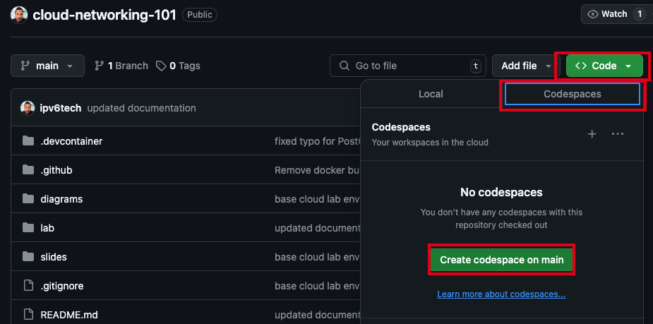

# Lab 2: Using GitHub Codespaces

In this Lab we will start up our GitHub Codespace with the Lab repository that will allow us to create a base cloud environment with each provider we'd like to build connectivity and test with. This will require access to your Cloud Service Provider accounts to create access credentials for the command line tools that the Terraform plans will use to provision the base cloud environments.

This Codespace includes a custom, prebuilt, devcontainer that has the following packages preinstalled.

1. AWS CLI
2. Azure CLI
3. Google Cloud SDK
4. Oracle Cloud CLI
5. Terraform

> [!NOTE]
> While it is possible to clone or fork the [Cloud Networking 101](https://github.com/ipv6tech/cloud-networking-101) workshop repository and bootstrap the cloud environments from your local device but the steps in this guide walk you through use GitHub Codespaces under your GitHub account.

---

## Starting GitHub Codespaces

You can use the easy :arrow_down: button

or follow these manual steps :arrow_down:

1. To get started sign in to your [GitHub](https://github.com/login) account.
2. Navigate to the [Cloud Networking 101](https://github.com/ipv6tech/cloud-networking-101) workshop repository.
3. Select `Code`, `Codespace`, `Create codespaces on main`.
 This should open a new window and start to spin up your new Codespace.

---

## Setting up the lab environment

> [!TIP]
> To save on time and frustration, only setup the cloud providers you actually want to use in the lab.

### Setting secrets and environment variables

In the repository there is a template secrets file that will help with this step. This will help with authenticating with the CSP's but also be used in the terraform plans to provision resources for our base environment so we don't have to edit a bunch of files for each provider.

Once we have credentials for each CSP we wish to work with we can set those as secrets for our codespace environment to use. This will keep the credentials out of our repositories.

Follow this **[how-to create codespaces secrets](https://docs.github.com/en/codespaces/managing-codespaces-for-your-organization/managing-development-environment-secrets-for-your-repository-or-organization#adding-secrets-for-a-repository)** for each of the private keys, passwords, etc for our CSP access.

---

### Authenticating CLI tools with each CSP

I'm not going to lie, this is going to be a bit of a slog for some of the providers. The easiest ones are Azure, AWS in that order. Google and Oracle are a bit more of a process.

<b>Prepare AWS</b>

1. To create an AWS security key, you can:
   1. Go to the AWS management console
   2. Click your profile name
   3. Click My Security Credentials
   4. Select Access Keys and click Create New Access Key
   5. Click Show Access Key
   6. Save and download the access key and secret access key
2. From the Codespaces shell run `aws configure`.
3. Copy and Paste the Access Key and Secret Access key from the AWS console into the Codespace shell when prompted.
4. At the prompt for region enter `us-east-1`.
5. At the prompt for Default output format [None]: you can accept the default of None and hit enter.

At this point you've configured AWS CLI tools with the same permissions as your user account and we will be able to use the Terraform plan to build the i2lab environment in AWS.

<b>Prepare Azure</b>

1. From the Codespaces shell run `az login --use-device-code`.
2. Follow the directions to authenticate the azure cli tools with your account.
3. From the output in the shell find the line that includes `"id": "000000-0000-0000-0000-00000000"` and copy the string.
4. From the Codespaces shell run `export TF_VAR_subscription_id="<paste the id from above>"` and hit enter.

At this point you've authenticated the Azure CLI tools with the permissions of your user account and exported the subscription_id as an environment variable that will be used by the Terraform plan to build out the Azure i2lab environment.

<b>Prepare Google Cloud</b>

> **Buckle up for this one!**

Before we can prepare the cli tools to build out our lab environment we have a bit of work to take care of.

>[!TIP]
>Hopefully you were able to complete the list below prior to the workshop.

- [Create a Google Cloud Account](https://cloud.google.com/free?hl=en).
- [Setup a billing account](https://cloud.google.com/billing/docs/how-to/create-billing-account#create-new-billing-account).
- [Create a project](https://cloud.google.com/resource-manager/docs/creating-managing-projects#creating_a_project) for the lab to provision into, I recommend something like `i2lab-2024` or `techex2024` for the project name.
- [Enable billing for the new project](https://cloud.google.com/billing/docs/how-to/modify-project).
- Enable Compute API for the project. (The easy way to do this is to navigate into the [VPC Networks](https://console.cloud.google.com/networking/networks) and click "Enable Compute API" in the console.)

#### Next authenticate the gcloud sdk tools with your Google Cloud account and create a credentials file

1. From the Codespaces shell run `gcloud init`.
2. At the prompt to sign in hit `enter`.
3. Copy the very long URL into a new web browser window and sign in with your Google Cloud account.
4. Copy the verification code.
5. Paste the verification code into the Codespaces shell and hit `enter`.
6. From the list choose the project you created for this workshop.
7. In the Codespaces shell run `gcloud projects list` and note the PROJECT_ID for your new project.
8. In the Codespaces shell run `export TF_VAR_gc_project_id="<PROJECT_ID>"`

#### Next we will create some credentials for our Codespaces shell

1. From the Codespaces shell run `gcloud auth application-default login`.
2. Copy the long URL from the Codespaces shell into a new web browser window.
3. Sign in to your Google Cloud Account.
4. Copy the verification code.
5. Paste the verification code into the Codespaces shell.

#### Delete Google Cloud default VPC

In the new project you created you likely have a default VPC Network. Let's go ahead and remove that mess.

1. To verify there is a _default_ VPC Network from the Codespaces shell `gcloud compute networks list`.
2. From the Codespaces shell run `gcloud compute networks delete default`.
3. At the "Do you want to continue." prompt hit `enter`.

<b>Prepare Oracle Cloud</b>

#### Create API keys and collect environment variables

1. Copy the oci public key, in a Codespaces shell, run `cat ~/.oci/oci_key_public.pem`.
2. In the OCI Console navigation to [My profile](https://cloud.oracle.com/identity/domains/my-profile).
3. Under the Resources section on the bottom left select `API Keys`.
4. Select `Add API Key`.
5. Select `Paste Public Keys`.
6. Paste the output from step #1, including the lines with BEGIN PUBLIC KEY and END PUBLIC KEY.
7. Select `Add`.

**3. Prepare the information you need to authenticate for OCI.**

Copy the information into the secrets file in the lab folder for the repo.

Collect the following credential information from the OCI Console.

- Tenancy OCID: <tenancy-ocid>
  - In the top navigation bar, click the Profile menu, go to Tenancy: <your-tenancy> and copy OCID.
- User OCID: <user-ocid>
  - From the Profile menu, go to User settings and copy OCID.
- Fingerprint: <fingerprint>
  - From the Profile menu, go to User settings and click API Keys.
Copy the fingerprint associated with the RSA public key you made in section 2. The format is: xx:xx:xx...xx.

Region: <region-identifier>

From the top navigation bar, find your region.

From the table in Regions and Availability Domains, Find your region's <region-identifier>. Example: `us-ashburn-1`.

Collect the following information from your environment.

Private Key Path: <rsa-private-key-path>

Path to the RSA private key you made in the Create RSA Keys section.

Example for Oracle Linux: /home/opc/.oci/<your-rsa-key-name>.pem

