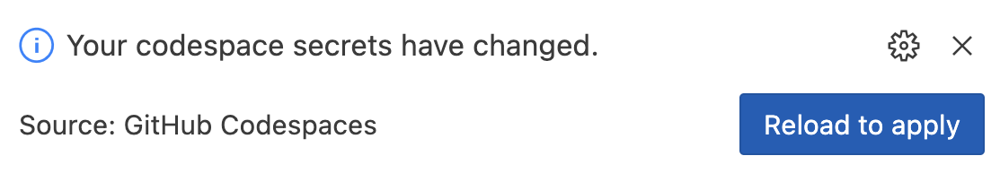
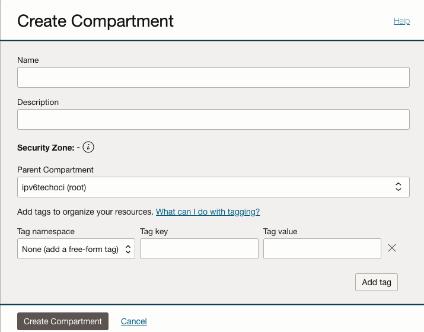

# Lab 3: Authenticating and Configure CLI tools

## Objective

I'm not going to kid you, this is going to be a bit of a slog to authentic and prepare the cli with some of the providers. The easiest ones are Azure, AWS in that order. Google and Oracle are a bit more of a process.

> [!TIP]
> To save on time (_and frustration_) only setup the cloud providers you actually want to use for the lab.

> [!IMPORTANT]
> If you didn't setup CSP accounts before the workshop you will need to do so before proceeding. [See here.](https://github.com/ipv6tech/cloud-networking-101?tab=readme-ov-file#further-learning)

### Set Common Environment Variables

1. From the Codespaces shell run `export TF_VAR_EMAIL="<your_email_goes_here>"`.
2. From the Codespaces shell run `export TF_VAR_ENV="i2lab"`.
3. Push the Environment variable to Codespace Secrets (to survive the instance restarts)

```bash
gh secret set TF_VAR_EMAIL -b "$TF_VAR_EMAIL" -u -r $GITHUB_REPOSITORY
gh secret set TF_VAR_ENV -b "$TF_VAR_ENV" -u -r $GITHUB_REPOSITORY
```

---

### Provider specific tool configuration

<details>
<summary><b>Prepare AWS</b></summary>

> **`NOTE:`** Make sure your AWS account has admin permissions!

1. To create an AWS security key, you can:
   1. Go to the AWS management console
   2. Click the `Profile name` pull down menu in the upper right hand of the screen.
   3. Click `Security Credentials`
   4. Find the Access Keys section and press `Create access key`.
   5. Select `Other` and press `Next`.
   6. _(Optional) Provide a description.
   7. Press `Create access key`.
   8. Click Show Access Key
   9. Press `Download .csv file` and save the keys on your local computer. (Leave this window/tab open)
2. From the Codespaces shell run `aws configure`.
3. Copy and Paste the Access Key and Secret Access key from the AWS console into the Codespace shell when prompted.
4. At the prompt for region enter `us-east-1`.
5. At the prompt for Default output format [None]: you can accept the default of None and hit enter.

At this point you've configured AWS CLI tools with the same permissions as your account.

</details>

---

<details>
<summary><b>Prepare Azure</b></summary>

#### Step 1: Authenticate Azure

1. From the Codespaces shell run `az login --use-device-code`.
2. Follow the directions to authenticate the azure cli tools with your account.
3. From the output in the shell find the line that includes `"id": "000000-0000-0000-0000-00000000"` where the zeros are replaced with an account ID and copy the string.
4. From the Codespaces shell run `export TF_VAR_AZ_SUBSCRIPTION_ID="<paste the id from above>"` and hit enter.

At this point you've authenticated the Azure CLI tools with the permissions of your user account and exported the subscription_id as an environment variable that will be used by the Terraform plan to build out the Azure i2lab environment.

#### Step 2: Push our Azure environment variables into Codespaces Secrets

Let's push the environment variable(s) we setup in the previous section our Codespaces Secrets. This is how we can get securely set and get the environment variables to persist between Codespace restarts.

1. Copy and paste the following into a Codespace Shell:

```bash
gh secret set TF_VAR_AZ_SUBSCRIPTION_ID -b "$TF_VAR_AZ_SUBSCRIPTION_ID" -u -r $GITHUB_REPOSITORY
```

2. In the message box that pops up press `Reload to apply`

**Congratulations!**

At this point you've configured Azure CLI tools with the same permissions as your account. If your account has admin privileges you should be able to use the Terraform plan to build the i2lab environment in Azure.

</details>

---

<details>
<summary><b>Prepare Google Cloud</b></summary>

> **Buckle up for this one!**

Before we can prepare the cli tools to build out our lab environment we have a bit of work to take care of.

> **`NOTE:`** Hopefully you were able to complete the list below prior to the workshop. If not it's pretty quick to click-ops through these items.

#### Prerequisites

- [Create a Google Cloud Account](https://cloud.google.com/free?hl=en).
- [Setup a billing account](https://cloud.google.com/billing/docs/how-to/create-billing-account#create-new-billing-account).
- [Create a project](https://cloud.google.com/resource-manager/docs/creating-managing-projects#creating_a_project) for the lab to provision into, I recommend something like `i2lab-2024` or `techex2024` for the project name.
- [Enable billing for the new project](https://cloud.google.com/billing/docs/how-to/modify-project).
- Enable Compute API for the project. (The easy way to do this is to navigate into the [VPC Networks](https://console.cloud.google.com/networking/networks) and click "Enable Compute API" in the console.)

#### Step 1: Authenticate the gcloud sdk tools with your Google Cloud account

1. From the Codespaces shell run `gcloud init`.
2. At the prompt to sign in hit `enter`.
3. Copy the very long URL into a new web browser window/tab and sign in with your Google Cloud account.
4. When prompted to `Sign in to Google Cloud SDK` Press `Continue`.
5. When prompted that `Google Cloud SDK wants access to your Google Account` press `Allow`.
6. Press `Copy` for the verification code.
7. Paste the verification code into the Codespaces shell and hit `enter`.
8. From the list choose the project you created for this workshop.
9. When prompted `to configure a default Compute Region and Zone` press `enter`.
10. Look for `us-east4-a` and `type the number` for that region and zone and press `enter`.
11. In the Codespaces shell run `gcloud projects list` and note the PROJECT_ID for your new project.
12. In the Codespaces shell run `export TF_VAR_GC_PROJECT_ID="<PROJECT_ID>"`

#### Step 2: Push our Google Cloud environment variables into Codespaces Secrets

Let's push the environment variable(s) we setup in the previous section our Codespaces Secrets. This is how we can get securely set and get the environment variables to persist between Codespace restarts.

Copy and paste the following into a Codespace Shell:

```bash
gh secret set TF_VAR_GC_PROJECT_ID -b "$TF_VAR_GC_PROJECT_ID" -u -r $GITHUB_REPOSITORY
```

2. In the message box that pops up press `Reload to apply`

#### Step 3: Next create credentials for our Codespaces shell

1. From the Codespaces shell run `gcloud auth application-default login`.
2. Copy the long URL from the Codespaces shell into a new web browser window.
3. Sign in to your Google Cloud Account.
4. When prompted to `Sign in to Google Auth Library` Press `Continue`.
5. When prompted that `Google Auth Library wants access to your Google Account` press `Allow`.
6. Press `Copy` for the verification code.
7. Paste the verification code into the Codespaces shell and hit `enter`.

#### Step 4: Delete Google Cloud default VPC Network

In the new project you created you likely have a default VPC Network. Let's go ahead and remove that mess.

1. To verify there is a _default_ VPC Network from the Codespaces shell `gcloud compute networks list`.
2. From the Codespaces shell run `gcloud compute networks delete default`.
3. At the "Do you want to continue." prompt hit `enter`.

**Congratulations!**

I wasn't kidding about the process to get this one ready for our lab. At this point you've configured gcloud sdk with the same permissions as your account. If your account has admin privileges and you have a blank project to work with you should be able to use the Terraform plan to build the i2lab environment.

</details>

---

<details>
<summary><b>Prepare Oracle Cloud</b></summary>

#### Step 1: Create a Compartment

1. [Follow this link](https://cloud.oracle.com/identity/compartments) to navigate to the OCI compartments service.
2. Press `Create Compartment` to create a new Compartment for the lab.
3. Name the Lab compartment `i2lab`.
4. Provide a description for the new compartment.
5. Press `Create Compartment`.
6. Select the new compartment name in the list of compartments. (You might have to refresh the page.)
7. Under Compartment Information use the `copy` link next to the OCID.
8. Set the OCI compartment variable: `export TF_VAR_OCI_COMPARTMENT="<paste_compartment_ocid>"`.

#### Step 2: Create API keys and set environment variables

1. In a Codespaces shell run `cat ~/.oci/oci_key_public.pem` and copy the output.
2. In the OCI Console navigation to [My profile](https://cloud.oracle.com/identity/domains/my-profile).
3. Under the Resources section on the bottom left select `API Keys`.
4. Select `Add API Key`.
5. Select `Paste Public Keys`.
6. Paste the output from the Codespaces shell in step #1, including the lines with BEGIN PUBLIC KEY and END PUBLIC KEY.
7. Select `Add`. Keep this window open for the next section.
8. From the Codespaces shell
   1. Set the OCI tenancy variable: `export TF_VAR_OCI_TENANCY="<paste_tenancy_ocid>"`.
   2. Set the OCI user variable: `export TF_VAR_OCI_USER="<paste_user_ocid>"`.
   3. Set the OCI fingerprint variable: `export TF_VAR_OCI_FINGERPRINT="<paste_fingerprint>"`.
   4. _(Optional)_ Set the OCI region variable: `export TF_VAR_OCI_REGION="<paste_region>"`.

#### Step 3: Push our OCI environment variables into Codespaces Secrets

Let's push the environment variable(s) we setup in the previous section our Codespaces Secrets. This is how we can get securely set and get the environment variables to persist between Codespace restarts.

1. Copy and paste the following into a Codespace Shell:

>```bash
>gh secret set TF_VAR_OCI_COMPARTMENT -b "$TF_VAR_OCI_COMPARTMENT" -u -r $GITHUB_REPOSITORY
>gh secret set TF_VAR_OCI_TENANCY -b "$TF_VAR_OCI_TENANCY" -u -r $GITHUB_REPOSITORY
>gh secret set TF_VAR_OCI_USER -b "$TF_VAR_OCI_USER" -u -r $GITHUB_REPOSITORY
>gh secret set TF_VAR_OCI_FINGERPRINT -b "$TF_VAR_OCI_FINGERPRINT" -u -r $GITHUB_REPOSITORY
>```

2. Optional:

> ```bash
> gh secret set TF_VAR_OCI_REGION -b "$TF_VAR_OCI_REGION" -u -r $GITHUB_REPOSITORY
> ```

3. In the message box that pops up press `Reload to apply`

<!--
Want to write these out to a file instead?

```bash
sed -i "/TF_VAR_OCI_COMPARTMENT=\"\"/c\TF_VAR_OCI_COMPARTMENT=\"$TF_VAR_OCI_COMPARTMENT\"" $CODESPACE_VSCODE_FOLDER/lab/files/secrets
sed -i "/TF_VAR_OCI_TENANCY=\"\"/c\TF_VAR_OCI_TENANCY=\"$TF_VAR_OCI_TENANCY\"" $CODESPACE_VSCODE_FOLDER/lab/files/secrets
sed -i "/TF_VAR_OCI_USER=\"\"/c\TF_VAR_OCI_USER=\"$TF_VAR_OCI_USER\"" $CODESPACE_VSCODE_FOLDER/lab/files/secrets
sed -i "/TF_VAR_OCI_FINGERPRINT=\"\"/c\TF_VAR_OCI_FINGERPRINT=\"$TF_VAR_OCI_FINGERPRINT\"" $CODESPACE_VSCODE_FOLDER/lab/files/secrets
```
-->

**Congratulations!**

At this point you've configured OCI CLI with the same permissions as your account. If your account has admin privileges you should be able to use the Terraform plan to build the i2lab environment.

</details>

---

## :rocket: [Onwards to Lab 4](lab4.md)
