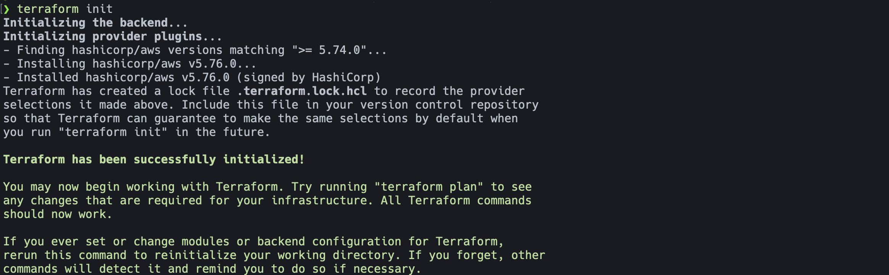
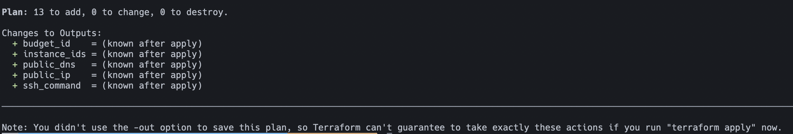
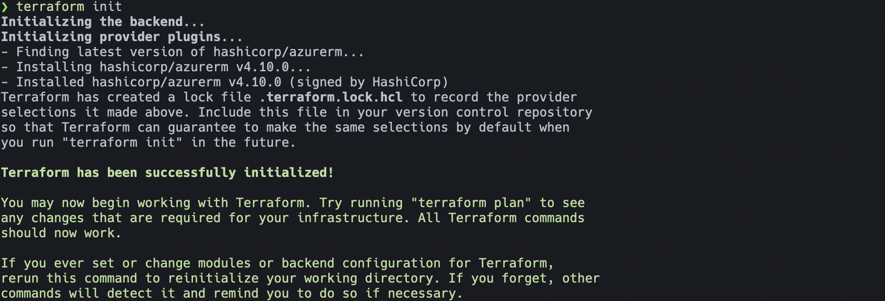
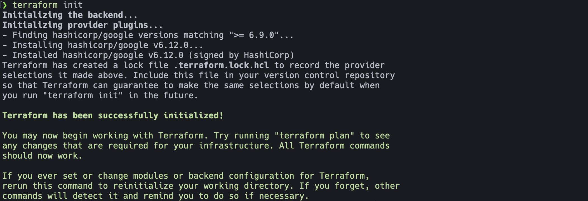
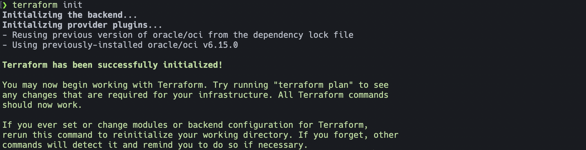

# Lab 4: Terraform deployment of CSP lab environments

Regardless of which CSP we are working with the workflow to build out the lab with the Terraform plans is the same.

This is a fun one and hopefully all the prep work we've done up to this point will pay off and make this part run smoothly. It's a pretty awesome feeling to provision and removing an environment with IaC with a few commands.

Use the Infrastructure as Code instructions below for each Cloud provider that you want to test with. Once you provision the environment log in to the console(s) and take a look at the resources that you've created in your account. Run a few verifying steps and get comfortable with how to operate inside the lab environment. Care was taken to try to make these are similar as possible.

> [!TIP]
> Want to provision multiple environments at once, just open another shell and get the next environment going.

> [!CAUTION]
> We are saving state for our environments locally, this is not a best practice and should never be done for a production environment. Make sure to not delete your Codespace instance until you've completely removed the lab environments for your cloud(s) otherwise you'll need to manually remove all the resources in the console(s).

<b>Prepare AWS</b>

## To provision the AWS lab environment

### Provision AWS

1. In the Codespaces shell run `cd $CODESPACE_VSCODE_FOLDER/lab/aws`.
2. Next run `terraform init`.

3. Next run `terraform plan`.

   1. If successful this will output a list of actions that will be performed.
4. Next we will run `terraform apply -auto-approve`.

> [!NOTE]
> This will take a while but should build out the base environment and spin up an instance that we can ssh into.

### Verify AWS

- Can you SSH to the instance?
  - This terraform plan should create an SSH config entry so you can use the Codespace shell to run `ssh i2lab-aws`.
- Does the instance have access to ping/traceroute via the IGW?

---

<b>Prepare Azure</b>

## To provision the Azure lab environment

### Provision Azure

1. In the Codespaces shell run `cd $CODESPACE_VSCODE_FOLDER/lab/azure`.
2. Next run `terraform init`.

3. Next run `terraform plan`.

   1. If successful this will output a list of actions that will be performed.
4. Next we will run `terraform apply -auto-approve`.

> [!NOTE]
> This one take the longest of all the lab environments to build out, the VNG can take quite some time (up to 45 minutes) to provision. Let this shell sit and open a new shell to work on other environments while you wait.

### Verify Azure

- Can you SSH to the instance?
  - This terraform plan should create an SSH config entry so you can use the Codespace shell to run `ssh i2lab-azure`.
- Does the instance have access to ping/traceroute via the IGW?

---

<b>Prepare Google Cloud</b>

## To provision the Google Cloud lab environment

### Provision Google Cloud

1. In the Codespaces shell run `cd $CODESPACE_VSCODE_FOLDER/lab/google`.
2. Next run `terraform init`.

3. Next run `terraform plan`.

   1. If successful this will output a list of actions that will be performed.
4. Next we will run `terraform apply -auto-approve`.

> [!NOTE]
> This one is pretty quick, resources should become available pretty quickly.

### Verify Google Cloud

- Can you SSH to the instance?
  - This terraform plan should create an SSH config entry so you can use the Codespace shell to run `ssh i2lab-google`.
- Does the instance have access to ping/traceroute via the IGW?

---

<b>Prepare Oracle Cloud</b>

## To provision the Oracle Cloud lab environment

### Provision Oracle Cloud

1. In the Codespaces shell run `cd $CODESPACE_VSCODE_FOLDER/lab/oracle`.
2. Next run `terraform init`.

3. Next run `terraform plan`.

   1. If successful this will output a list of actions that will be performed.
4. Next we will run `terraform apply -auto-approve`.

> [!NOTE]
> This one is very quick to provision.

### Verify

- Can you SSH to the instance?
  - This terraform plan should create an SSH config entry so you can use the Codespace shell to run `ssh i2lab-oracle`.
- Does the instance have access to ping/traceroute via the IGW?

---

At this point you have provisioned the base lab environment with two or more cloud providers.

## :rocket: [Take me to Lab 5](lab5.md)
