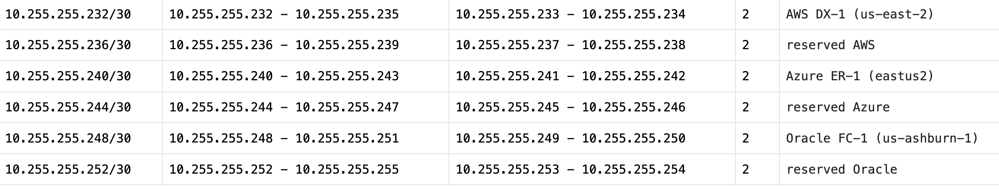
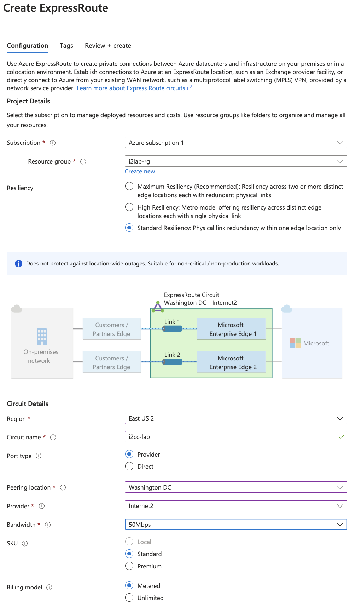
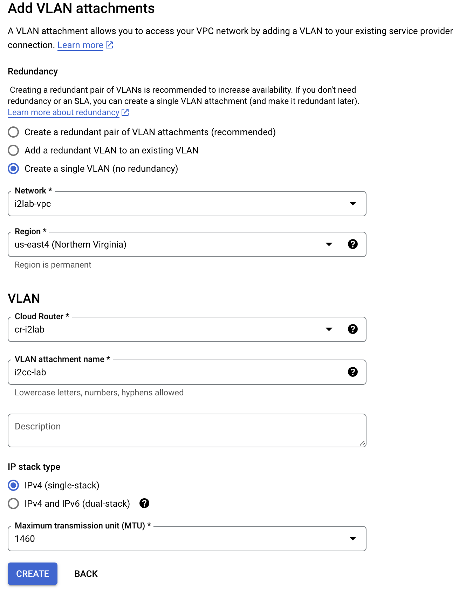
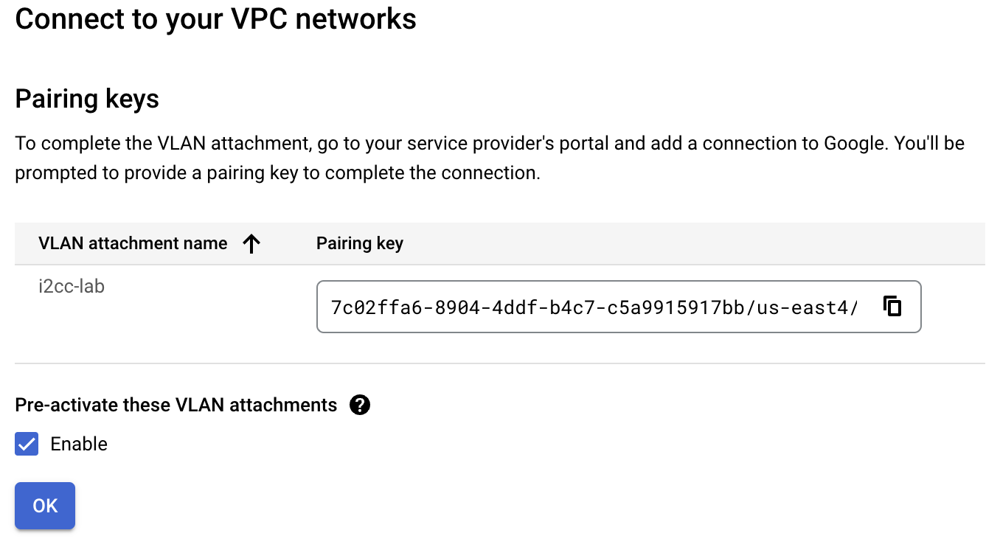
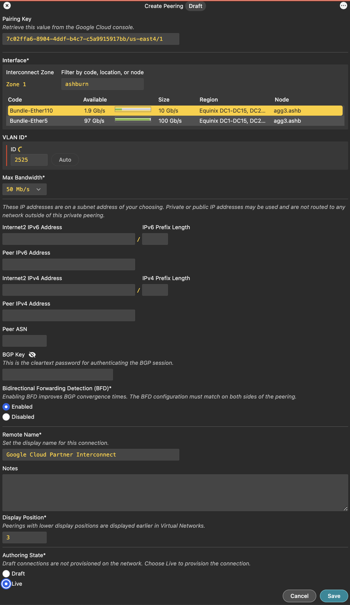
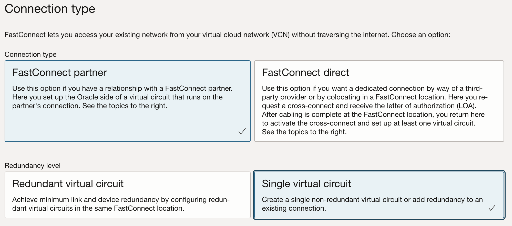
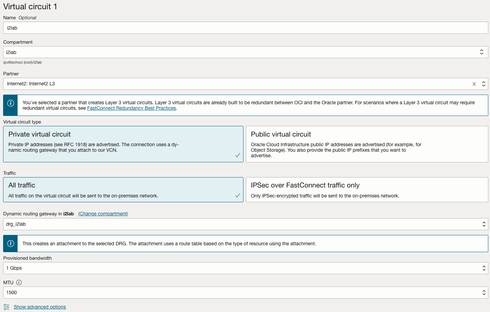
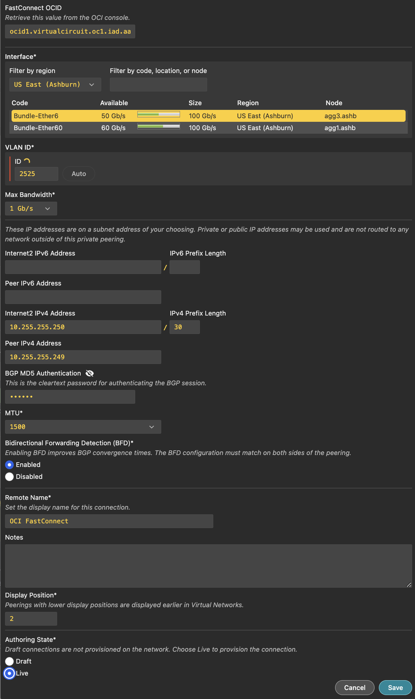

# Lab 5: Building Dedicated Connections to the Cloud

## Objective

Establish connectivity between the Internet2 Virtual Router, that you build in **[Lab 1](lab1.md)**, and the CSPs of your choice.

While some key components of dedicated connectivity have been provisioned with code in **[Lab 3](lab3.md)**, there are some resources, such as Azure VNG's that just take too long to manually deploy and wait for. One of the primary objectives of this workshop was to understand the components necessary for dedicated connectivity with the various CSPs. While some of these steps are simple to achieve using code I felt it was important to do some of the processes manually so you could see the components that connect together first hand.

### Multicloud Routing Diagram

### Dedicated connection IPv4 addressing plan

The image below shows the IPv4 addressing used for the dedicated connections with each provider, except for Google, used in the labs. (Google assigns reserved link-local addressing from 169.254.0.0/16.)

---

<b>AWS: Building a Hosted Direct Connect (DX) Connection</b>

### Step 1: Starting in the Internet2 Insight Console

1. Navigate to your Virtual Network Space (VNS) from [Lab 1](lab1.md)
2. Find the Virtual Router you created in Lab 1.
3. Select **`Add Peering using AWS Direct Connect`**.

4. In the **Create Peering** window fill in the details:
   - Enter your **AWS Account ID**.
   - **Region** select **`US East (N. Virginia)`**.
   - Select an **Interface** by clicking on one to highlight it.
   - **VLAN ID** use the **`Auto`** button to pick the next available VLAN ID _(Note the VLAN ID, you'll need the VLAN ID later)_.
   - **Max Bandwidth** select **`50 Mb/s`**.
   - **Internet2 IPv4 Address** enter **`10.255.255.234`** and for the prefix enter **`30`**.
   - **Peer IPv4 Address** enter **`10.255.255.233`**.
   - **AWS ASN** enter **`65001`**.
   - **BGP Authentication Key** enter **`some_secret`**. _(**Note:** If you don't provide a key here AWS will and you will need to edit this connection to enter the AWS provided BGP Authentication key before BGP will come up.)_
   - **MTU** at 1500 for our lab.
   - _(Optional)_ For the **Remote Name** you can enter a unique name.
   - _(Optional)_ Enter some details for the **Notes**.
   - Set the **Authoring State** to **`Live`**. (Let's Go! This isn't production! :rocket:) 
5. Press **`Save`**.

### Step 2: Accept the Direct Connect Connection

From within the AWS Console:

1. Search for **Direct Connect**.
2. Select the new connection and pick **`View details`**.
3. On the next screen select **`Accept`** for the connection. _(This will take a few minutes)_

### Step 3: Configure AWS Direct Connect Gateway with a Transit VIF

After the connection shows as available:

1. Select **`Virtual Interfaces`** in the left side bar.
2. Select **`Create virtual interface`**.
3. Select **`Transit`** under the **Virtual interface type**.
4. Enter a Virtual interface name like **`tvif-1`**.
5. In the **Connection** pull down select the DX Connection we accepted above :arrow_up:.
6. In the **Direct Connect gateway** pull down select **`dxgw-i2lab`**.
7. Enter the **VLAN ID** you choose in the Insight Console for the next connection.
8. Enter **`55038`** for the **BGP ASN** (of the Internet2 Virtual Router).
9. Expand the **Additional settings** section.
10. Enter **`10.255.255.234/30`** for **Your router peer ip**.
11. Enter **`10.255.255.233/30`** for **Amazon router peer IP**.
12. Enter **`some_secret`** for the **BGP authentication key**.
13. Select **``Create virtual interface``**.

> **Note:** It typically take a while for the peering state and BGP status to show available. There must be a health check that periodically updates this status.
>

### Step 4: Associate the TGW with the DXGW

Now that you built the DX connection and the DXGW peering we need to associate the Transit Gateway to the Direct Connect Gateway.

1. Select **`Transit Gateway`** from the left sidebar.
2. Select the transit gateway and press **`View details`**.
3. Press the orange **`Associate Direct Connect gateway`** button.
4. Under Association settings/Direct Connect gateways select **`dxgw-i2lab`**.
5. Under **Allowed prefixes** enter **`10.192.0.0/16`**,**`10.192.1.0/24`**, and **`10.192.0.240/28`**.
6. Press the orange **`Associate Direct Connect gateway`** button.

> **Note:** This take a good long while, go ahead and move on to the next step and check back periodically.

### Step 5: Attach the TGW with the i2lab VPC

The final step for the AWS connectivity in this lab is to attach the transit gateway with the `i2lab` VPC.

1. In the AWS Console search or navigate to the [VPC service](https://us-east-1.console.aws.amazon.com/vpcconsole/home?region=us-east-1#Home:).
2. In the left side bar find the Transit Gateway section and select `Transit gateway attachments`.
3. Press the orange **`Create transit gateway attachment`** button.
4. Enter **`tgw-att-1`** for the **Name tag**.
5. Select the transit gateway in the **Transit gateway ID** pull down.
6. Make sure the attachment type is set to **VPC**.
7. Under the VPC attachment section, select the VPC in the **VPC ID** pull down menu.
8. Under the Subnet IDs pull down select the subnet that include the name **`tgw-i2lab`**.
9. Press the orange **`Create transit gateway attachment`** button.

> **Note:** This take a good long while, go ahead and move on to the next step and check back periodically.

---

<b>Azure: Building an ExpressRoute (ER) Connection</b>

### Step 1: Create ExpressRoute circuit

The process of building ExpressRoute connections from Azure to Internet2 Insight Console begin in the [Azure Portal](https://portal.azure.com/#browse/Microsoft.Network%2FexpressRouteCircuits).

1. Navigate to the [Azure ExpressRoute service](https://portal.azure.com/#browse/Microsoft.Network%2FexpressRouteCircuits).
2. Press **`Create ExpressRoute circuit`**.
3. Fill in the configuration details:
   - Choose your **Subscription**.
   - **Resource group** choose **`i2lab-rg`**.
   - **Resiliency** select **`Standard Resiliency`**.
   - **Region** select **`East US 2`**.
   - **Circuit Name** enter **`i2cc-lab`** or similar.
   - **Port type** select **`Provider`**.
   - **Peering location** search **`Washington DC`**.
   - **Provider** select **`Internet2`**.
   - **Bandwidth** select **`50Mbps`**.
   - Leave **SKU** and **Billing model** set to the defaults of **`Standard`** and **`Metered`**. 
4. Press **`Review + create`**.
5. On the next screen press **`Create`**.
6. This will take a minute or two but when it finished you can press **`Go to resource`**.
7. Under the new ExpressRoute resource you need the **`Service Key`** for Step 2, go ahead and `copy to clipboard`.

### Step 2: Create the ExpressRoute Provisioning Request

This portion of the circuit creation happens in the Internet2 [Insight Console](https://console.internet2.edu/#/vn/list).

1. Navigate to your Virtual Network Space (VNS) from [Lab 1](lab1.md).
2. Find the Virtual Router you created in Lab 1.
3. Select **`Add Peering using Azure ExpressRoute`**.

4. Fill in the details:
   - **`Service Key`** from Step 1 above.
   - **`VLAN ID`**. _(Any ID will do for our lab.)_
   - **Internet2 IPv4 Address** enter **`10.255.255.242`**.
   - **IPv4 Prefix Length** enter **`30`**.
   - **Peer IPv4 Address** enter **`10.255.255.241`**.
   - Leave BFD **Enabled**.
   - _(Optional)_ Change the **Remote Name**.
   - _(Optional)_ Input some notes about the connection.
   - Set the **Authoring State** to **`Live`** and live dangerously!

5. Press **`Save`**.

> **NOTE:** ExpressRoute service provides a second circuit for redundancy but we'll skip configuring that for the lab.

### Step 3: Create Connection from VPN Gateway (VNG) to ExpressRoute

Using the Terraform plan in Lab 3 we already created a VNG resource named **`i2lab-vng`** and public IP address for that service. Creating a VNG takes quite some time and was the primary motivators in using code to spin up some base resources.

1. Navigate or search for the **`i2lab-vng`** resource or [VNG service](https://portal.azure.com/#view/Microsoft_Azure_HybridNetworking/CreateConnectionBladeV2).
2. In the left menu bar for the **`i2lab-vng`** resource find Settings>Connections.
3. Press **`+ Add`** to start the connection creation.
4. For **Connection type** select **`ExpressRoute`**.
5. Press **`Review + create`**.
6. ...... MORE DETAILS HERE
7. ..... MORE DETAILS NEEDED
8. ...Waiting on IC to get fixed before I can continue...

---

<b>Google: Building a Partner Interconnect Connection</b>

The process of building a Partner Interconnect starts in the [Google Cloud Console](https://console.cloud.google.com/hybrid/interconnects/).

Create a VLAN attachment for a Partner Interconnect connection. This step generates a pairing key that you use in Internet2 Insight Console. The pairing key is a unique key that lets a service provider identify and connect to your Virtual Private Cloud (VPC) network and associated Cloud Router. The Internet2 Console requires this key to complete the configuration of your VLAN attachment.

### Step 1: Create the Interconnect attachment

In the Google Cloud Console:

1. Use the menu to navigate to **Network Connectivity > Interconnect**.
2. Press **`Create VLAN attachments`**.
3. Select **`Partner Interconnect connection`**.
4. In the Encrypt interconnect section, select **`Set up unencrypted Interconnect`**.
5. Press **`Continue`**.
6. On the next screen select **`I already have a service provider`**.
7. Fill in the **Add VLAN attachments** form:
   - **Redundancy** select **`Create a single VLAN`** and press **`Continue`** in the pop up message box.
   - **Network** select **`i2lab-vpc`**.
   - **Region** select **`us-east4 (North Virginia)`**.
   - **Cloud Router** select **`cr-i2lab`**.
   - **VLAN attachment name** enter **`i2cc-vlan`** or similar.
   - _(Optional)_ **Description**
   - **IP stack type** select **`IPv4 (single-stack)`**.
   - **Maximum transmission unit (MTU)** choose **`1460`**. _(Matches our prebuilt environment.)_ 

8. Press **`Create`**. _(Sometimes this action can take a minute or two to complete.)_
9. After creation is complete, **copy the pairing key**. _(You will use these keys in the Internet2 Insight Console when you create the Google Partner Interconnect Connection.)_

10. **Pre-activate these VLAN attachments** by selecting **`Enable`**.
11. In the pop-up window choose **`I UNDERSTAND,PRE-ACTIVATE`**.

### Step 2: Create the Internet2 Interconnect to Google Cloud

1. Navigate to your Virtual Network Space (VNS) from [Lab 1](lab1.md).
2. Find the Virtual Router you created in Lab 1.
3. Select **`Add Peering using Google Cloud Partner Interconnect`**.
4. Enter the connection details:
   - **Pairing Key** from the Google Cloud Console in Step 1 above.
   - **Region** select **`Equinix DC1-DC15, DC21 - Ashburn`**.
   - Choose an **Interface** that has bandwidth available.
   - **VLAN ID** use the **`Auto`** button to pick the next available VLAN ID.
   - **Max Bandwidth** select **`50 Mb/s`**.
   - **IP Addressing** You can complete skip the IP Addressing for the Internet2 and Peer. _(This just gets overridden by Google.)_
   - **Peer ASN** enter **`16550`**.
   - _(Optional)_ For the **BGP Authentication Key** enter **`some_secret`**. _(If you set one in the Google Console you'll need to match it here or BGP won't come up.)_
   - _(Optional)_ For the **Remote Name** you can enter a unique name.
   - _(Optional)_ Enter some details for the **Notes**.
   - Set the **Authoring State** to **`Live`** and live dangerously!

1. Press **`Save`**.

---

<b>Oracle: Building a FastConnect Connection</b>

### Step 1: Create the FastConnect Connection-

Start in the Oracle Console

1. Search or navigate to the [FastConnect service](https://cloud.oracle.com/networking/fast-connect).
2. Press **`Create FastConnect`**
3. Choose **FastConnect Partner** and **Single virtual circuit** for the connection type and redundancy level.

4. Press **`Next`** to continue.
5. Fill in virtual connection details:
   - **Name** enter a name for the connection (e.g., **`i2lab-i2cc`**).
   - **Compartment** select the compartment you created in **[Lab 3](lab3.md)** (e.g., **`i2lab`**).
   - **Partner** search for **`Internet2: Internet2 L3`**.
   - **Virtual circuit type** choose **`Private Circuit`**.
   - **Traffic** choose **`All traffic`**.
   - **Dynamic routing gateway** choose **`drg-i2lab`**.
   - **Provisioned Bandwidth** select **`1Gbps`**.

6. Press **`Create`**.
7. Wait for the Oracle console page to refresh and show the new circuit.
8. Select the new circuit and find the **`OCID`** for connection. Copy this value you need it for Step 2.

### Step 2: Create the FastConnect connection in Insight Console

From Internet2 Insight Console

1. Navigate to your Virtual Network Space (VNS) from [Lab 1](lab1.md).
2. Find the Virtual Router you created in Lab 1.
3. Select **`Add Peering using OCI FastConnect`**.
4. Enter the connection details:
   - **FastConnect OCID** paste the **`OCID`** from Step 1.
   - **Interface** > Filter by Region select **`US East (Ashburn)`**.
   - **Interface** > choose an available **Interface**.
   - **VLAN ID** use the **`Auto`** button to pick the next available VLAN ID.
   - **Max Bandwidth** choose **`1 GB/s`**.
   - **Internet2 IPv4 Address** enter **`10.255.255.250`** and for the prefix enter **`30`**.
   - **Peer IPv4 Address** enter **`10.255.255.249`**.
   - **BGP Authentication Key** enter **`some_secret`**.
   - **MTU** at 1500 for our lab.
   - _(Optional)_ **Remote Name** leave as is or modify.
   - _(Optional)_ **Notes** enter details about the connection.
   - Set the **Authoring State** to **`Live`**. (Let's Go! This isn't production! :rocket:)

5. Press **`Save`**.

---

**Nice work!**

At this point you've got the dedicated connectivity built to your cloud service providers. 

## :rocket: [I'm ready for Lab 6](lab6.md)
