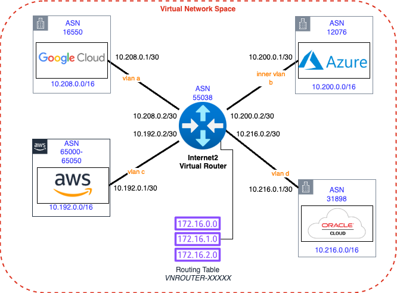
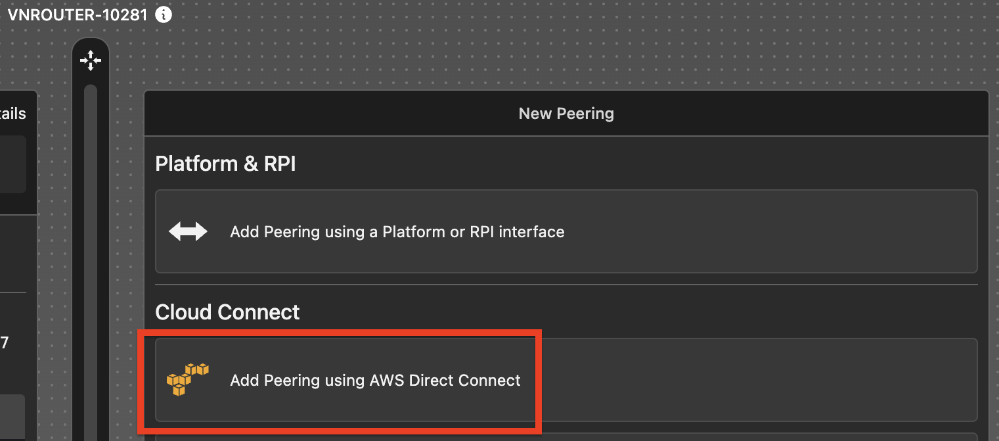
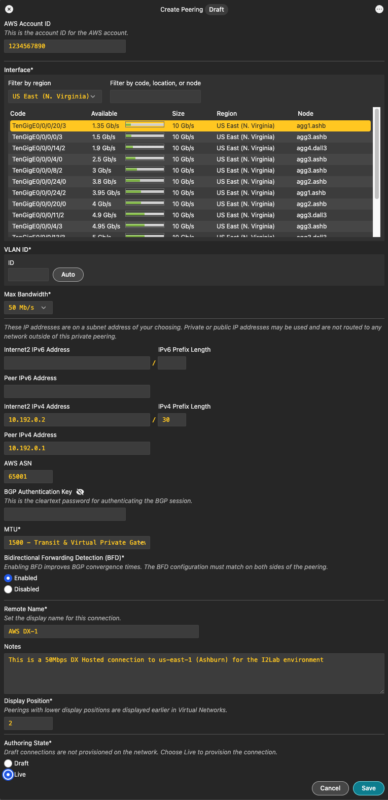
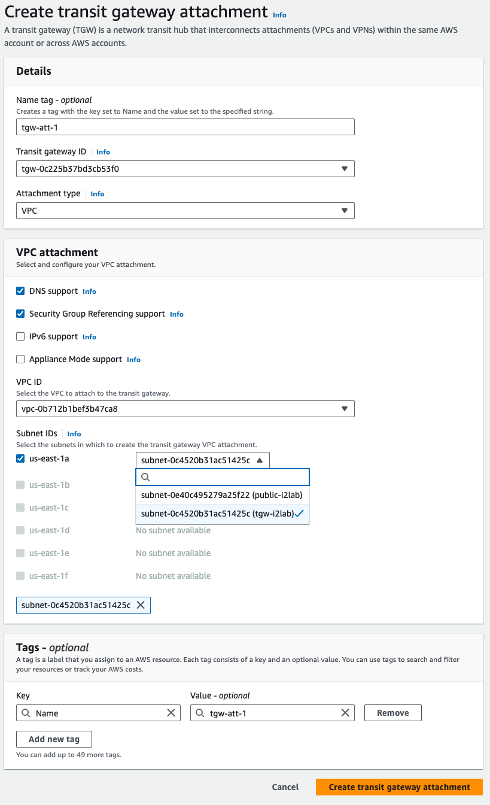
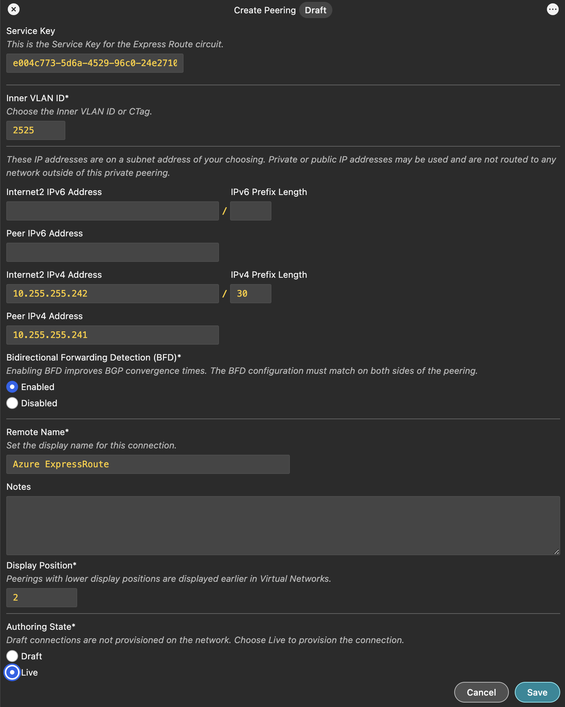

# Lab 5: Building Dedicated Connections to the Cloud

## Objective

Establish connectivity between the Internet2 Virtual Router, that you build in [Lab 1](lab1.md), and the CSPs of your choice.

There are steps included for each CSP that you wish to build a dedicated connection with below.

 

---

<b>AWS: Building a Hosted Direct Connect (DX) Connection</b>

### Step 1: Starting in the Internet2 Insight Console

1. Navigate to your Virtual Network Space (VNS) from [Lab 1](lab1.md)
2. Find the Virtual Router you created in Lab 1.
3. Select **`Add Peering using AWS Direct Connect`**.

4. Enter your **AWS Account ID**.
5. Filter by region to select **`US East (N. Virginia)`**.
6. Select an Interfaces that has bandwidth available.
7. Enter a **VLAN ID** or use the **`Auto`** button to pick the next available VLAN ID _(Note the VLAN ID, you'll need the VLAN ID later)_.
8. For **Max Bandwidth** select **`50 Mb/s`**.
9. For the **Internet2 IPv4 Address** enter **`10.192.0.2`** and for the prefix enter **`30`**.
10. For the **AWS ASN** enter **`65001`**.
11. For the **BGP Authentication Key** enter **`some_secret`**.
12. Leave the **MTU** at 1500 for our lab.
13. _(Optional)_ For the **Remote Name** you can enter a unique name.
14. _(Optional)_ Enter some details for the **Notes**.
15. Set the **Authoring State** to **`Live`** and live dangerously!

### Step 2: Accept the Direct Connect Connection

From the AWS Console

1. Search for **Direct Connect**.
2. Select the new connection and pick **`View details`**.
3. On the next screen select **`Accept`** for the connection. _(This will take a few minutes)_

### Step 3: Configure AWS Direct Connect Gateway with a Transit VIF

After the connection shows as available

1. Select **`Virtual Interfaces`** in the left side bar.
2. Select **`Create virtual interface`**.
3. Select **`Transit`** under the **Virtual interface type**.
4. Enter a Virtual interface name like **`tvif-1`**.
5. In the **Connection** pull down select the DX Connection we accepted above :arrow_up:.
6. In the **Direct Connect gateway** pull down select **`dxgw-i2lab`**.
7. Enter the **VLAN ID** you choose in the Insight Console for the next connection.
8. Enter **`55038`** for the **BGP ASN** (of the Internet2 Virtual Router).
9. Expand the **Additional settings** section.
10. Enter **`10.192.0.2/30`** for **Your router peer ip**.
11. Enter **`10.192.0.1/30`** for **Amazon router peer IP**.
12. Enter **`some_secret`** for the **BGP authentication key**.
13. Select **``Create virtual interface``** 

> [!NOTE]
> It will take a while for the peering state and BGP status to show available. There must be a health check that periodically updates this status.

### Associate the TGW with the DXGW

Now that you built the DX connection and the DXGW peering we need to associate the Transit Gateway to the Direct Connect Gateway.

1. Select **`Transit Gateway`** from the left sidebar.
2. Select the transit gateway and press **`View details`**.
3. Press the orange **`Associate Direct Connect gateway`** button.
4. Under Association settings/Direct Connect gateways select **`dxgw-i2lab`**.
5. Under **Allowed prefixes** enter **`10.192.0.0/16`**,**`10.192.1.0/24`**, and **`10.192.0.240/28`**.
6. Press the orange **`Associate Direct Connect gateway`** button.

> [!NOTE]
> This take a good long while, go ahead and move on to the next step and check back periodically.

### Attach the TGW with the i2lab VPC

The final step for the AWS connectivity in this lab is to attach the transit gateway with the `i2lab` vpc.

1. In the AWS Console search or navigate to the [VPC service](https://us-east-1.console.aws.amazon.com/vpcconsole/home?region=us-east-1#Home:).
2. In the left side bar find the Transit Gateway section and select `Transit gateway attachments`.
3. Press the orange **`Create transit gateway attachment`** button.
4. Enter **`tgw-att-1`** for the **Name tag**.
5. Select the transit gateway in the **Transit gateway ID** pull down.
6. Make sure the attachment type is set to **VPC**.
7. Under the VPC attachment section, select the VPC in the **VPC ID** pull down menu.
8. Under the Subnet IDs pull down select the subnet that include the name **`tgw-i2lab`**.
9. Press the orange **`Create transit gateway attachment`** button.

> [!NOTE]
> This take a good long while, go ahead and move on to the next step and check back periodically.

---

<b>Azure: Building an ExpressRoute (ER) Connection</b>

### Step 1: Create ExpressRoute circuit

The process of building ExpressRoute connections from Azure to Internet2 Insight Console begin in the [Azure Portal](https://portal.azure.com/#browse/Microsoft.Network%2FexpressRouteCircuits).

1. Navigate to the [Azure ExpressRoute service](https://portal.azure.com/#browse/Microsoft.Network%2FexpressRouteCircuits).
2. Press **`Create ExpressRoute circuit`**.
3. In the **Resource group** pull down menu select **`i2lab-rg`**.
4. For **Resiliency** select **`Standard Resiliency`**.
5. In the **Region** pull down menu select **`East US 2`**.
6. Type **`i2cc-lab`** or similar for the **Circuit name**.
7. Leave **Port type** set as **`Provider`**.
8. For **Peering location** select **`Washington DC`**.
9. For **Provider** select **`Internet2`**.
10. For **Bandwidth** select **`50Mbps`**.
11. Leave **SKU** and **Billing model** set to the defaults of **`Standard`** and **`Metered`**.
12. Press **`Review + create`**.
13. On the next screen press **`Create`**.
14. This will take a minute or two but when it finished you can press **`Go to resource`**.
15. Under the new ExpressRoute resource you need the **`Service Key`** for Step 2, go ahead and `copy to clipboard`.

### Step 2: Create the ExpressRoute Provisioning Request

This portion of the circuit creation happens in the Internet2 [Insight Console](https://console.internet2.edu/#/vn/list).

1. Navigate to your Virtual Network Space (VNS) from [Lab 1](lab1.md).
2. Find the Virtual Router you created in Lab 1.
3. Select **`Add Peering using Azure ExpressRoute`**.

4. Paste in your **`Service Key`** from Step 1 above.
5. Choose a **`VLAN ID`**. _(Any ID will do for our lab.)_
6. For Internet2 IPv4 Address enter **`10.0.0.10`**.
7. For **IPv4 Prefix Length** enter **`30`**.
8. For **Peer IPv4 Address** enter **`10.0.0.9`**.
9. Leave BFD **Enabled**.
10. _(Optional)_ Change the **Remote Name**.
11. _(Optional)_ Input some notes about the connection.
12. Set the **Authoring State** to **`Live`** and live dangerously!
13. Press **`Save`**.

> NOTE: ExpressRoute service provides a second circuit for redundancy but we'll skip configuring that for the lab.

### Step 3: Create Connection from VPN Gateway (VNG) to ExpressRoute

Using the Terraform Plan in Lab 3 we already created a VNG resource named **`i2lab-vng`** and public IP address for that service. If we hadn't those would be needed before proceeding and can take quite some time to create.

1. Navigate or search for the **`i2lab-vng`** resource or [VNG service](https://portal.azure.com/#view/Microsoft_Azure_HybridNetworking/CreateConnectionBladeV2).
2. In the left menu bar for the **`i2lab-vng`** resource find Settings>Connections.
3. Press **`+ Add`** to start the connection creation.
4. For **Connection type** select **`ExpressRoute`**.
5. Press **`Review + create`**.
6. ...... MORE DETAILS HERE

---

<b>Google: Building a Partner Interconnect Connection</b>

The process of building a Partner Interconnect starts in the [Google Cloud Console](https://console.cloud.google.com/hybrid/interconnects/).

Create a VLAN attachment for a Partner Interconnect connection. This step generates a pairing key that you use in Internet2 Insight Console. The pairing key is a unique key that lets a service provider identify and connect to your Virtual Private Cloud (VPC) network and associated Cloud Router. The Internet2 Console requires this key to complete the configuration of your VLAN attachment.

### Step 1: Create the Interconnect attachment

1. In the Google Cloud console, go to the Cloud Interconnect VLAN attachments tab.
2. Press **`Create VLAN attachments`**.
3. Select **`Partner Interconnect connection`**.
4. In the Encrypt interconnect section, select **`Set up unencrypted Interconnect`**.
5. Press **`Continue`**.
6. On the next screen select **`I already have a service provider`**.
7. Select **`Create a single VLAN`**.
8. For the Network and Region fields, select the **`i2lab-vpc`** network and the **`us-east4`** region.
9.  Under the Cloud Router pull down select **`cr-i2lab`**.
10. VLAN attachment name: Give the VLAN a name such as **`i2cc-vlan`** for the attachment.
11. IP stack type: Select **`IPv4 (single-stack)`**.
12. Use a Maximum transmission unit (MTU) for the attachment of **`1460`**. _(The VPC network that uses the attachment must have an MTU set to the same value. In addition, the on-premises virtual machine (VM) instances and routers must have their MTU set to the same value as well. If your network has the default MTU of 1460, then select 1460 as the VLAN attachment MTU.)_
13. To create the attachments, press **`Create`**. _(This action takes a few minutes to complete.)_
14. After creation is complete, **copy the pairing keys**. You will use these keys in the Internet2 Insight Console when you create the Google Partner Interconnect Connection.
15. Since we are requesting a Layer 3 connection with Internet2, you can pre-activate the attachment by selecting **`Enable`**. _(Activating attachments enables you to confirm that you're connecting to the expected service provider. Pre-activating attachments enables you to skip the activation step and lets the attachments start passing traffic immediately after your service provider completes their configuration.)_

### Optional Interconnect Steps

1. **(_Optional_)** You can optionally update your BGP sessions to use MD5 authentication. (I'd recommend skipping this for our lab environment, it'll be one less thing to configure or troubleshoot.)
2. **(_Optional_)** Bidirectional Forwarding Detection (BFD) for Cloud Router detects forwarding path outages such as link down events, allowing for more resilient hybrid networks. To update your BGP session to use BFD, see Configuring BFD.

### Step 2: Create the Internet2 Interconnect to Google Cloud

1. Navigate to your Virtual Network Space (VNS) from [Lab 1](lab1.md).
2. Find the Virtual Router you created in Lab 1.
3. Select **`Add Peering using Google Cloud Partner Interconnect`**.

4. Enter your **Pairing Key** from Step 1 above.
5. Filter by region to select **`Equinix DC1-DC15, DC21 - Ashburn`**.
6. Select an Interfaces that has bandwidth available.
7. Enter a **VLAN ID** or use the **`Auto`** button to pick the next available VLAN ID _(Note the VLAN ID, you'll need the VLAN ID later)_.
8. For **Max Bandwidth** select **`50 Mb/s`**.
9. You can complete skip the IP Addressing for the Internet2 and Peer. _(This just gets overridden by Google.)_
10. For the **Peer ASN** enter **`16550`**.
11. _(Optional)_ For the **BGP Authentication Key** enter **`some_secret`**. _(If you set one in the Google Console you'll need to match it here or BGP won't come up.)_
12. _(Optional)_ For the **Remote Name** you can enter a unique name.
13. _(Optional)_ Enter some details for the **Notes**.
14. Set the **Authoring State** to **`Live`** and live dangerously!

---

<b>Oracle: Building a FastConnect Connection</b>

### Step 1: Create the FastConnect Connection

1. Navigate to FastConnect
2. Create FastConnect
3. Create FastConnect Connection in Insight Console

---

**Nice work!**

At this point you've got the dedicated connectivity built to your cloud service providers. 

## :rocket: [I'm ready for Lab 6](lab6.md)
