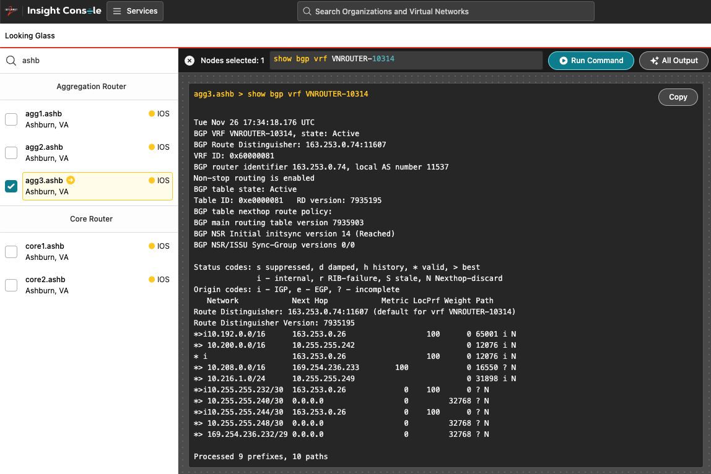
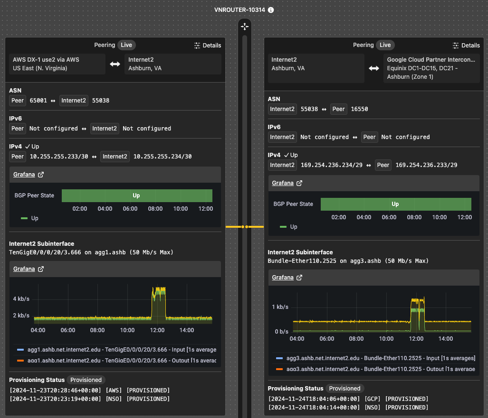

# Lab 6: Testing and verifying routing

## Objective

In this brief Lab we will verify that BGP is active and routes are exchanging between peers.

Inside Insight Console there are two primary places to look to verify that our dedicated connections have established BGP states and routes are being exchanged.

### Verify routing table with Looking Glass

The best place to verify routing, today, is by using the Insight Console Looking Glass tool.

Using the command **`show bgp vrf VNROUTER-NNXXX`** against the correct Internet2 router will show the BGP prefixes in the routing table on that router.

1. From the Virtual Network Space note or copy the VRF ID in the left sidebar for the Virtual Router.
2. On the Virtual Router note the physical device one of the connections uses (e.g., agg1.ashb).
3. Navigate to Insight Console Looking Glass
4. Select the Internet2 router that one of connections uses (e.g., agg3.ashb).
5. Type **`show bgp vrf <paste_VRF_ID>`**.
6. Press **`Run Command`**.

## Verify BGP peer state

Another place to look in the console is at the Virtual Router in the VNS. Each of the connections will eventually show BGP state "up" and traffic graphs. This can take time for the UI and graphing engine to catch up and start displaying connection state.

## :rocket: [Take me to Lab 7](lab7.md)
