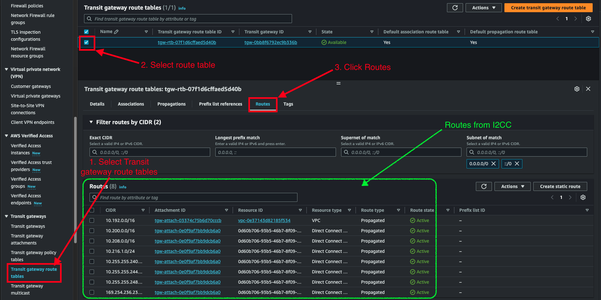

# Lab 7: Verifying Routing Tables with the CSPs

In this lab we will look at some of the network tools that the CSPs provide to help look at the routing tables and which prefixes are seen by our i2lab environment with that provider.

## Table of Contents

- [AWS Routing](#aws-routing)
- [Azure Routing](#azure-routing)
- [Google Cloud Routing](#google-cloud-routing)
- [Oracle Cloud Routing](#oracle-cloud-routing)

---

## AWS Routing

### Transit gateway route table view

Inside the AWS Console one place that you can check to see which routes are being propagated is under the Transit gateway routing table.

To view the Transit gateway routing table: Navigate to VPC and find Transit Gateway service in the sidebar menu.

1. Select **Transit gateway route tables**.
2. Select the checkbox for the **route table**.
3. Click **routes**.

You should notice the routes that are propagated from the DXGW to the TGW route table match the networks from the other cloud providers.

### _(Optional) Cloud Native way_

This one is the least straight forward. There is the "cloud native" way to do prefix monitoring and BGP peer state alerting.

This [blog](https://aws.amazon.com/blogs/networking-and-content-delivery/monitor-bgp-status-on-aws-direct-connect-vifs-and-track-prefix-count-advertised-over-transit-vif/) has a great walk-through on alerting and monitoring BGP status and prefix counts. If you have time and would like to try this walk-through, on your own, feel free. Make sure to leave enough time for [Lab 8](lab8.md) where we will destroy the lab environments and clean-up resources to avoid paying unnecessary bills.

---

## Azure Routing

There are two common places in Azure that you can look for routing information. The first is in the ER peerings service and the second is in the subnet/VPC level.

### ER Peering Routing Table

How to view the ER routing table:

1. Use the portal search to search for the ExpressRoute service.
2. **Click** on the **`i2cc-lab`** ExpressRoute circuit.
3. In the left menu bar press **`Peerings`**.
4. Click on the **Azure private** peering line in the main window. (We're trying to highlight that Azure private line, not actually go into the peering configuration.)
5. Press **View route table**.

---

## Google Cloud Routing

The best place in Google Cloud to view what the routing table looks like is from within the VPC.

### VPC Effective Routes

1. Navigate to the [VPC Network service](https://console.cloud.google.com/networking/networks)
2. Press **Routes** in the sidebar menu
3. In the **EFFECTIVE ROUTES** panel:
   - **Network** select **`i2lab-vpc`**.
   - **Region** select **`us-east4 (Northern Virginia)`**.
4. Press **VIEW**.

This will show you the routes that are learned and installed in the VPC routing table.
> **Bonus:** Try another region and see what the routing table looks like.

---

## Oracle Cloud Routing

### Dynamic route gateway routes

Viewing the routes learned by the DRG is nested and easy to miss unless you are really familiar with what you are looking for or know it's even possible.

Here are the steps to view the routes learned and installed in a routing table by the DRG.

1. Open the navigation menu and click Networking. Under Customer connectivity, click Dynamic routing gateway.
2. Under List Scope, select the compartment that contains the DRG with route table information you want to get.
3. The page updates to display only the resources in that compartment. If you're not sure which compartment to use, contact an administrator. For more information, see Access Control.
4. Click the name of the DRG.
5. Under Resources, choose a DRG route tables by clicking on it.
6. Select **`Get all route rules`**.

Here's what a DRG route table with routes from the Internet2 Virtual Router should look like:

